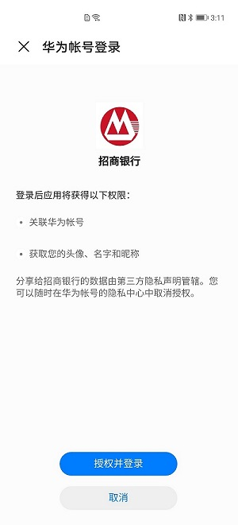

# 业务介绍

-   [业务简介](#section1897113912198)
-   [服务特点](#section11964820202912)
-   [场景介绍](#section172763509299)
-   [快捷登录应用](#section144081440152912)
-   [受限说明](#section39031340132920)
-   [支持的终端设备](#section199351939122310)

## 业务简介

华为帐号服务（HUAWEI Account Kit）为您提供了简单、安全的登录授权功能，方便用户快捷登录。用户不必输入帐号、密码和繁琐验证，就可以通过“华为帐号登录”快速登录，即刻使用您的App。

[https://mos-vod-drcn.dbankcdn.cn/P\_VT/video\_injection/22/v3/D9B5EB3B368798369348361216/MP4Mix\_H.264\_1920x1080\_6000\_HEAAC1\_PVC\_NoCut.mp4](https://mos-vod-drcn.dbankcdn.cn/P_VT/video_injection/22/v3/D9B5EB3B368798369348361216/MP4Mix_H.264_1920x1080_6000_HEAAC1_PVC_NoCut.md)

[https://videoplay-mos-dra.dbankcdn.com/P\_VT/video\_injection/AD/v3/1576EB37368839970246376448/MP4Mix\_H.264\_1920x1080\_6000\_HEAAC1\_PVC\_NoCut.mp4](https://videoplay-mos-dra.dbankcdn.com/P_VT/video_injection/AD/v3/1576EB37368839970246376448/MP4Mix_H.264_1920x1080_6000_HEAAC1_PVC_NoCut.md)

更多华为帐号服务视频内容，请参见[华为开发者学院HMS课堂](https://developer.huawei.com/consumer/cn/training/result?searchTxt=%E5%8D%8E%E4%B8%BA%E5%B8%90%E5%8F%B7%E6%9C%8D%E5%8A%A1)[华为开发者学院HMS课堂](https://developer.huawei.com/consumer/en/training/result?searchTxt=Account%20Kit)。

## 服务特点

-   接入方便，规范统一

    服务手机、平板、智慧屏等全场景生态，接入规范统一，方便您接入华为生态。

-   海量用户，全球化服务

    服务全球[190+国家和地区](支持的国家-地区.md)，支持[70+种语言](zh-cn_topic_0000001050040564.md)，服务9亿+用户。

-   安全可靠，遵循国际标准

    遵循[OAuth 2.0](https://oauth.net/2/)和[OpenID Connect](https://openid.net/connect/)等国际标准协议，遵循GDPR隐私规范，具备高安全性密码验证和手机号验证双因素认证能力，风险实时通知。

## 场景介绍

## 快捷登录应用

终端用户可以使用华为帐号登录应用，首次登录应用需要用户授权确认，后续即可一键登录。且帐号实现全场景生态，一个帐号即可登录所有应用。

## 受限说明

## 支持的终端设备

<table><thead align="left"><tr id="row955254311011"><th class="cellrowborder" valign="top" width="41.13411341134113%" id="mcps1.1.4.1.1">
终端设备

</th>
<th class="cellrowborder" valign="top" width="26.002600260026004%" id="mcps1.1.4.1.2">
设备类型

</th>
<th class="cellrowborder" valign="top" width="32.86328632863286%" id="mcps1.1.4.1.3">
HMS Core（APK）版本

</th>
</tr>
</thead>
<tbody><tr id="row155284321013"><td class="cellrowborder" valign="top" width="41.13411341134113%" headers="mcps1.1.4.1.1 ">
华为终端设备

</td>
<td class="cellrowborder" valign="top" width="26.002600260026004%" headers="mcps1.1.4.1.2 ">
手机、平板、智慧屏

</td>
<td class="cellrowborder" valign="top" width="32.86328632863286%" headers="mcps1.1.4.1.3 ">
4.0.0.300及以上

</td>
</tr>
</tbody>
</table>

